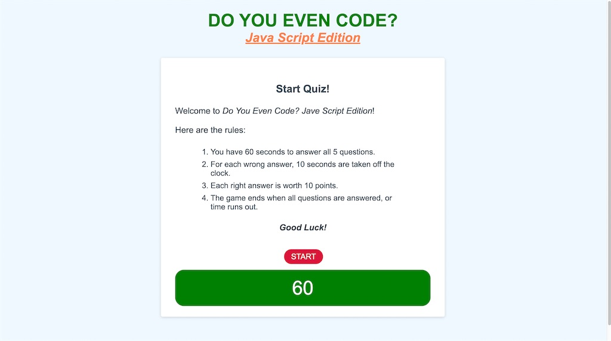

# JS-Quiz "Do You Even Code?"

## Purpose

To create an interactive quiz game on JavaScript using HTML, CSS and JavaScript. This quiz game will have a 60 second timer to get through 5 questions. For every wrong answer, 10 seconds will be shaved from the timer.

## Built With

- HTML
- CSS
- JavaScript

## Website

www.placeholder.com

## Contribution

Made with ❤️ by Patrick Narcisse (aka narcpat)

## Credits

The following YouTube video by Code Explained was instrumental in helping me develop this project. It largely influenced, many aspects of the Quiz including, how to retrieve questions and answers, and how to display progress (write and wrong answers).

From Code Explained YouTube Channel
https://youtu.be/49pYIMygIcU

The following answer on Stack Overflow by "Dave" helped me figure out how to set the timer and remove time from it for incorrect answers.

https://stackoverflow.com/questions/58964755/subtract-time-from-timer-if-answer-is-wrong-creating-a-quiz-javascript

## Special Thanks

A special thanks to Learning Assistants Derrick and Royce, who helped me get past certain hurdles with the timer function.
